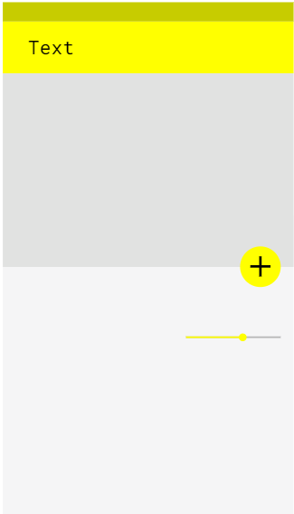
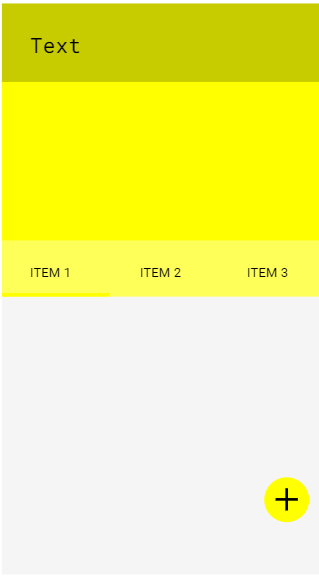
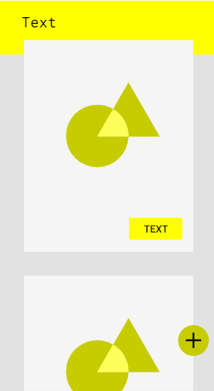
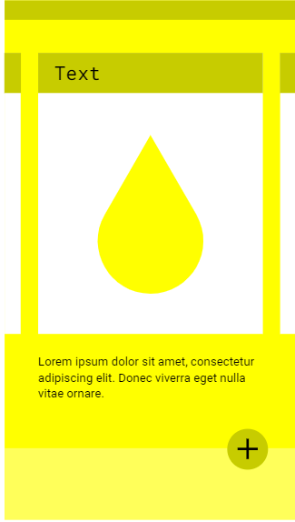
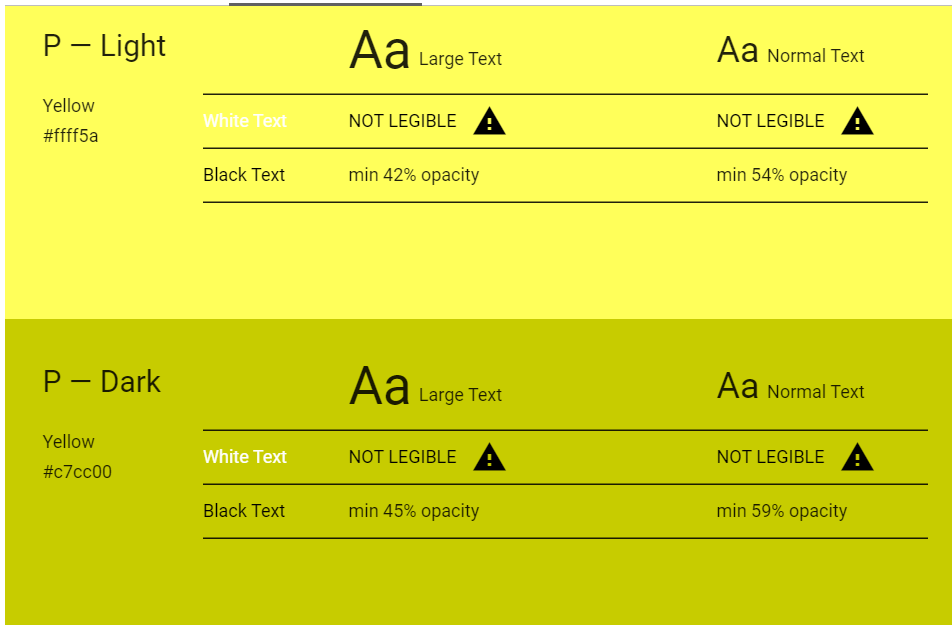

## Primary

<Grid columns={2} gap={4}>
<BrandBox>
<BrandColor 
    colorName = "Black"
    colorHex = "#000000"
    colorRGB = "0, 0, 0"
    colorCMYK = "0, 0, 0, 0"
/>
<BrandCaption>Black black doesn’t really exist (SEE: Vantablack, Black 3.0). 
Moreover, hard blacks can ‘hurt’ on screen, however, for now bodyLITERATE uses a hard black. We will likely change this 
in a future iterations. As described by Revaratio: "grey blacks look faded in print. Black is actually a pretty hard colour. 
EIL has a different black for print and digital. Pure black is never used.  
The print black is not a rich black, but should always be used with overprint on." 
</BrandCaption>
</BrandBox>
<BrandBox>
<BrandColor 
    colorName = "White"
    colorHex = "#FFFFFF"
    colorRGB = "255, 255, 255"
    colorCMYK = "0, 0, 0, 98"
/>
<BrandCaption>Wwe use the basic white. 
</BrandCaption>
</BrandBox>
</Grid>

 

<Grid columns={3} gap={4}>
    <BrandColor 
        colorName = "YELLOW"
        colorHex = "#ffff00"
        colorRGB = "255, 255, 0"
    />
    <BrandColor 
        colorName = "PĪLĀ YELLOW"
        colorHex = "#ffff5a"
        colorRGB = "255, 255, 90"
    
    />
    <BrandColor 
        colorName = "GOLDEN FOIL"
        colorHex = "#c7cc00"
        colorRGB = "252, 221, 136"
    />
    <BrandColor 
        colorName = "YELLOW SUBMARIN"
        colorHex = "#ffff14"
        colorRGB = "157, 198, 229"
        colorCMYK = "42, 10, 0, 0"
    />
</Grid>

 

**Campuses** Each of the campuses is associated with a primary colour — this is used in campus specific communication or branding. For example, social media profiles, video borders, city platforms or campus signage. Countries use the colour of the campus capital.

---

## Combinations

You are free to combine colours as you see fit for the most part, but here are some guidelines to prevent unfortunate results:

<Grid columns={4}>

<BrandBox>

</BrandBox>

<BrandBox>

</BrandBox>

<BrandBox>

</BrandBox>

<BrandBox>

</BrandBox>

</Grid>

### Contrast

Especially when using text, be mindful of contrast. Web standards recommend, for AA (minimum) and AAA (high) the following contrasts: (use this tool to check)

|       &nbsp;       |      &nbsp;               | AA           | AAA           |
| :----------------- | ------------------------- |:------------:| :------------:| 
| Normal Text        | 16px + Regular            | 4.5:1        | 7:1           |
| Medium Text         | 32px + Bold, or 24px + | 3:1          | 4.5:1         |
| Large Text         | 42px + Bold, or 50px + | 3:1          | 4.5:1         |

Here ae some visual examples:

<BrandBox>

</BrandBox>