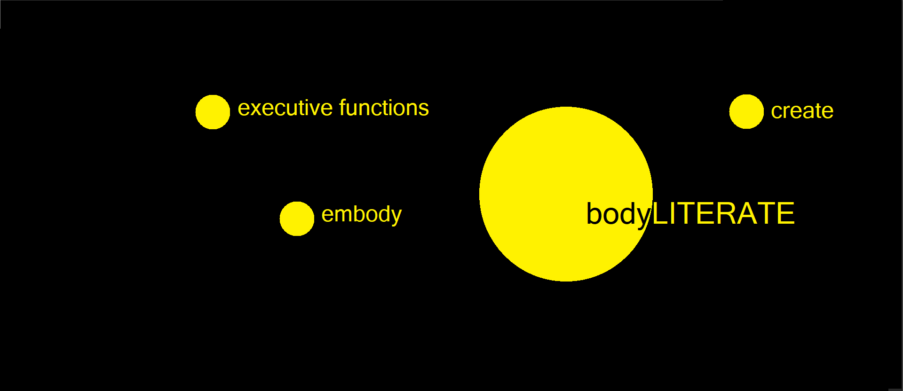
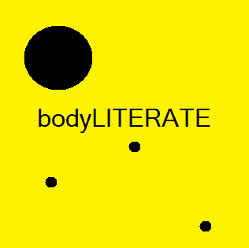
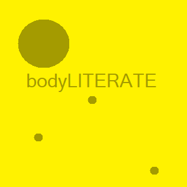
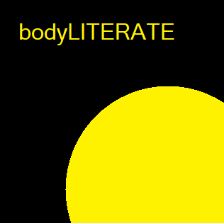
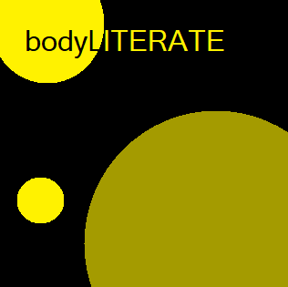

## The Name

To maintain consistency across countries and languages, the name of bodyLITERATE is always written the same way: Title Case, with lowercase ```body``` and followed by uppercase ```LITERATE```.
To highlight the the name, we will often keep lowercase ```executive functions```, ```embody``` and ```create``` as the three lenses from which bodyLITERATE operates.
>FUTURE CONSIDERATIONS: the name bodyLITERATE is being analyzed for future considerations. We have wondered whether the word "LITERATE" creates an ablelist framework. Being "literate" 
has often been used as a way to be exclusionary, whether it's language-based literacy, math literacy, computer literacy. We want to celebrate the unique ways people find literacy and broaden this idea (example, phsyical literacy, artistic literacy). 
So our name is currently in flux and may change.

<BrandRule do={true} Background={true}>  
bodyLITERATE
</BrandRule>

<BrandRule do={true} Background={true}> bodyLITERATE Executive Functions Coaching</BrandRule>  
<BrandRule do={true} Background={true}>bodyLITERATE Education Services</BrandRule>  
<BrandRule do={true} Background={true}>bL</BrandRule>    

<Grid gap={2} columns={2}>
<BrandRule do={false} > body  LITERATE</BrandRule>   
<BrandBox color='#828282'>Do not place a space between body and LITERATE.</BrandBox>
</Grid>

<Grid gap={2} columns={2}>
<BrandRule do={false} > bL ...Coaching...</BrandRule>   
<BrandBox color='#828282'>Do not add more text after bL if using bL in a name.</BrandBox>
</Grid>

<Grid gap={2} columns={2}>
<BrandRule do={false} > Bodyliterate</BrandRule>   
<BrandBox color='#828282'> Do not use uppercase at the start of a word</BrandBox>
</Grid>

<Grid gap={2} columns={2}>
<BrandRule do={false} > Body Literate</BrandRule>   
<BrandBox color='#828282'>Do not uppercase both words. </BrandBox>
</Grid>

<Grid gap={2} columns={2}>
<BrandRule do={false} > BODYliterate</BrandRule>   
<BrandBox color='#828282'> Do not uppercase BODY </BrandBox>
</Grid>

<Grid gap={2} columns={2}>
<BrandRule do={false}  > The bodyLITERATE</BrandRule>   
<BrandBox color='#828282'> Do not use The in front of bodyLITERATE </BrandBox>
</Grid>

---

## The Logos

The various editions of the logos are to be used based on scenario. The simplest is the solo logo, which is used in most situations.

### Solo

The following guidelines for the 3 versions of every logo unit apply to all logo units.

<Grid columns={1}>

<BrandBox>


**Transparent**
This is to be used on undisturbed, light backgrounds at large scale only.
</BrandBox>

</Grid>


### Square

A special series of square logos exist for social media profiles. They are exclusively for this use, and never to be used on any communication materials.

<Grid columns={4}>

<BrandBox>


</BrandBox>

<BrandBox>


</BrandBox>

<BrandBox>


</BrandBox>

<BrandBox>


</BrandBox>

</Grid>

>SPECIAL CONSIDERATION TO MATERIAL DESIGN: The aim here is to use the framework of Material Design. 
Shapes are generally rectangles, but one can customize their corners. We aim to use clear, distinguishable shapes 
that give meaning based on size, position on the canvas and color.
