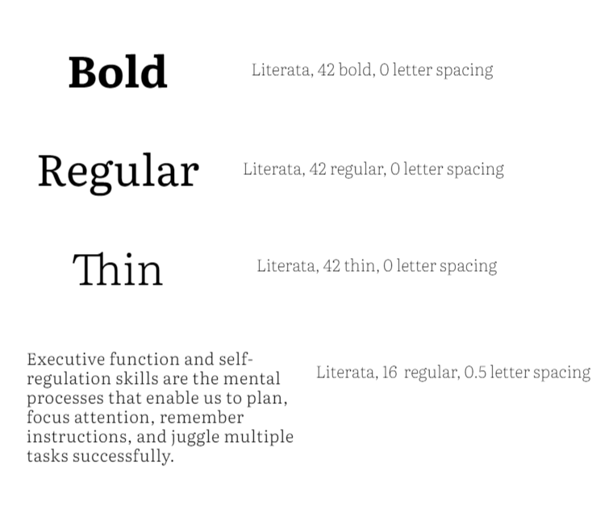

## Fonts

All communication and creatives use only two font: ```Literata``` and ```Microsoft Sans Serif```. Literata is favored, however, it's less readily available

<Grid gap={2} columns={2}>
  <BrandFont 
    fontName="Literata"
    font="Literata"
    />
    <BrandFont 
    fontName="San Serif"
    font="Microsoft Sans Serif"
    />
</Grid>

<Grid gap={2} columns={2}>
  <BrandBox>
    <BrandRule
      noBackground={true}
      font='Literata'
      fontSize='24px'
      fontWeight='200'
      >Literata</BrandRule>
    <BrandRule
      noBackground={true}
      font='Literata'
      fontSize='24px'
      fontWeight='400'
      >Literata</BrandRule>
    <BrandRule
      noBackground={true}
      font='Literata'
      fontSize='24px'
      fontWeight='600'
      >Literata Bold</BrandRule>
    <BrandRule
      do={false}
      noBackground={true}
      font='Montserrat'
      fontSize='24px'
      fontWeight='800'
      >Gotham</BrandRule>
      
  </BrandBox>

  <BrandBox>
    <BrandRule
      noBackground={true}
      font='Playfair Display'
      fontSize='24px'
      fontWeight='400'
      >Micorosoft San Serif</BrandRule>
    <BrandRule
      do={false}
      noBackground={true}
      font='Playfair Display'
      fontSize='24px'
      fontWeight='800'
      >EIL Bold</BrandRule>
      
  </BrandBox>

</Grid>


Most creative work and communication will use Literata. Microsoft Sans Serif is to be used selectively, in low volume and large scale only. It may be used for situations where Literata is uavailable.
Specific sizes and spacings generally used for headings and paragraphs



## Styles 


The below are a series of suggested styles of typography. They are not exhaustive. Nor should all designs use all these styles at once. Combine a minimum of styles to maximise communication hierarchy.

<BrandBox 
  noBackground={true}
  font='Literata'
  fontSize='60px'
  lineHeight='80px'
   > Top title</BrandBox>   
<BrandCaption extraSpace={true}> This is usually used as a top level title, never more than once in a single creative. Make not of relatively tight tracking and leading on these fonts.</BrandCaption>  

<BrandBox 
  noBackground={true}
  font='Literata'
  fontSize='30px'
  lineHeight='40px'
   > Secondary title</BrandBox>  
  <BrandBox 
  noBackground={true}
  font='Literata'
  fontSize='25px'
  lineHeight='40px'
   > Tertiary title</BrandBox>

<BrandCaption extraSpace={true}> Always start with uppercase, except for bodyLITERATE </BrandCaption>

<BrandBox 
  noBackground={true}
  font='Literata'
  fontSize='26px'
  fontWeight='200'
  lineHeight='30px'
   > Leading or subtitle text usually running
over two or more lines</BrandBox>  

<BrandCaption extraSpace={true}> This is one of the rare uses of the black highlighed version 
of "bodyLITERATE" and also the yellow highlighted version of the three core lenses: "embodiment", 
"create", "executive functions". Used under top level titles, or before main body text in
 documents and written digital communication. It is intended to contain the main message of the 
 proceeding paragraphs. </BrandCaption>

<Grid columns={[3, '3fr 1fr 3fr']} gap={5}>
  <BrandBox>

 
</BrandBox>

  <BrandBox>


</BrandBox>
</Grid>

<BrandCaption extraSpace={true}> Used in a the 5 main colors using the Design Tokens, but always the same style,  height, and black underline; only with EIL Sans Bold. 
This is a style used either for titles or for links (digital) that are ‘invitations’ to discover other pages. 
Make special note of the spacing around the text, which defines the size of the ‘band’. Also note that the ‘underline’ is strictly the thickness of the letter I in EIL Sans Bold at the given size.  </BrandCaption>

Body text **always** uses Literate. Do not set body entirely in bold text, although it may be used to highlight content. Also do not set any body text in Light, it is illisible. In terms of text decoration, you may used __underline__, or ~~strikethrough~~. Italics is not used. 

<BrandCaption extraSpace={true}> 
Make note of the proportion between font size and leading: 1:1.5 is the minimum ratio. 
Also note that for large blocks of text (50+ words), we always maintain width to have 10-12 words a line.
Additionally, letter spacing is set at 0.5 rem  
</BrandCaption>

<br /> 


<BrandBox 
  noBackground={true}
  color='#c7cc00'
  font='Literata'
  fontSize='100px'
  lineHeight='20px'
   >“”</BrandBox>  


<BrandBox 
  noBackground={true}
  color='#000000'
  font='Literata'
  fontSize='100px'
  lineHeight='20px'
   >“”</BrandBox>  


<BrandCaption extraSpace={true}> Note that quote marks are always displayed in Literata </BrandCaption>


---

## Compositions

<BrandBox> 


</BrandBox>

The below are some examples of how composition is used to make titles with the Literata typography. Please make special note of permitted colour use (only bands, not text), of the use of EIL Sans Bold uppercase, selective used of EIL Serif, equidistant spacing around text in bands, and weight of ‘stroke’ or ‘underline’.

<BrandRule noBackground={true}>Here are some examples of banded compositions </BrandRule>

<BrandBox Background='#f5f5f5' extraSpace={true}> 

<Grid columns={2}>
<BrandBox> 


</BrandBox>

<BrandBox> 
<BrandCaption>
Occasional use of Literata for large type
</BrandCaption>
<BrandCaption>
White bands, when followed by a black, are the only ones which can take a coloured underline.
</BrandCaption>
</BrandBox>

</Grid>

<Grid columns={2}>
<BrandBox> 


</BrandBox>

<BrandBox> 
<BrandCaption>
Text is ONLY ever in Literata Black or white, whichever maximises contrast with the background. 
</BrandCaption>
</BrandBox>

</Grid>

<Grid columns={2}>
<BrandBox> 


</BrandBox>

<BrandBox> 
<BrandCaption>
Literata Black or white bands may be used without underline. 
</BrandCaption>
<BrandCaption>
Coloured bands MUST have an underline in Literata Black. 
Each ‘composition’ may use only 1 colour in addition to Literata Black and yellow. 
</BrandCaption>
</BrandBox>

<BrandBox> 


</BrandBox>

<BrandBox> 
<BrandCaption>
Literata Black or white bands may be used without underline. 
</BrandCaption>
<BrandCaption>
Coloured bands MUST have an underline in Literata Black. 
Each ‘composition’ may use only 1 colour in addition to Literata Black and yellow. 
</BrandCaption>
</BrandBox>

<BrandBox> 


</BrandBox>

<BrandBox> 
<BrandCaption>
Literata Black or white bands may be used without underline. 
</BrandCaption>
<BrandCaption>
Coloured bands MUST have an underline in Literata Black. 
Each ‘composition’ may use only 1 colour in addition to Literata Black and yellow. 
</BrandCaption>
</BrandBox>

</Grid>

<Grid columns={2}>
<BrandBox> 


</BrandBox>

<BrandBox> 
<BrandCaption>
Bands may be scaled and ordered as to create hierarchy. 
However, refrain from having more than 3 band heights. 
</BrandCaption>
<BrandCaption>
Microsoft Sans Serif is not in uppercase. 
</BrandCaption>
</BrandBox>

</Grid>

</BrandBox>

<br /> 

<BrandRule do={false} noBackground={true}>Here are some composiitons mistakes you should avoid </BrandRule>

<BrandBox Background='#f5f5f5' extraSpace={true}> 

<Grid columns={2}>
<BrandBox> 


</BrandBox>

<BrandBox> 
<BrandCaption>
Coloured underlines on non-white bands. 
</BrandCaption>
<BrandCaption>
Coloured text
</BrandCaption>
</BrandBox>

</Grid>

</BrandBox>

